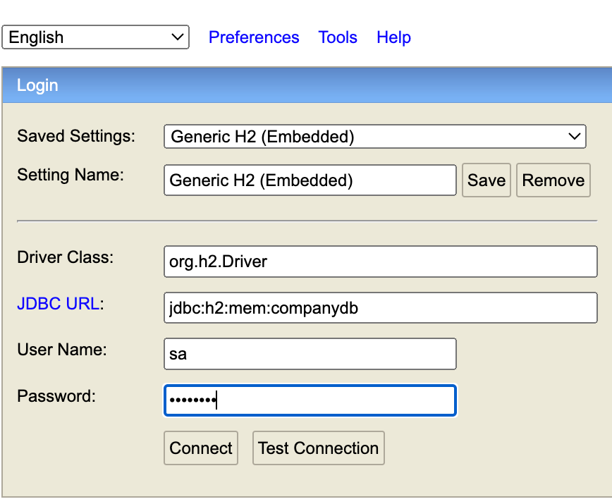

# company-search-service

This is a Java rest microservice / Maven / Spring Boot (version 3.2.5) /H2 DB.
The service provides a resource to search for companies from TruProxyAPI. 
The service runs an in memory H2 DB to store data returned from TruProxyAPI for faster access based on input request. 

## How to Run

This application is packaged as a war which has Tomcat embedded.

* Clone this repository
* You can build the project and run the tests by running ```mvn clean package```
* Once successfully built, you can run the service by one of these two methods:
```
        run it from intelliJ or any other IDE
or
        mvn spring-boot:run
```
* Check the stdout to make sure no exceptions are thrown

Once the application runs you should see something like this

```
Started CompanySearchServiceApplication in 3.72 seconds (process running for 9.337)
```
H2-DB has been configured to run in memory and can be accessed on: http://localhost:8080/h2-console/login.jsp (Password: password)



## About the Service

The service is just a simple companies search REST service. It uses an in-memory database (H2) to store the data.
It calls TruProxyAPI to retrieve companies and officers information, the information is then stored in "companydb" database and returned to client.
If a request is sent with company-number, a lookup is done in companydb and if data is found its returned to client without calling TruProxyAPI.

Sample Get Endpoint:
```
http://localhost:8080/companies/search?OnlyActiveCompanies=false
```

sample request json:
```
{
    "companyName":"BBC",
    "companyNumber":"SC783452"
}
```

Here are some sample requests:

### Search for companies by company-name/company-number
```
curl --location --request GET 'localhost:8080/companies/search?OnlyActiveCompanies=false' \
--header 'x-api-key: <please-add-valid-key-here>' \
--header 'Content-Type: application/json' \
--data-raw '{
    "companyName":"BBC"
}'

curl --location --request GET 'localhost:8080/companies/search?OnlyActiveCompanies=true' \
--header 'x-api-key: <please-add-valid-key-here>' \
--header 'Content-Type: application/json' \
--data-raw '{
    "companyName":"BBC"
}'


curl --location --request GET 'localhost:8080/companies/search?OnlyActiveCompanies=false' \
--header 'x-api-key: <please-add-valid-key-here>' \
--header 'Content-Type: application/json' \
--data-raw '{
    "companyName":"BBC",
    "companyNumber":"SC783452"
}'
```

### TODOs
* Improve test coverage.
* Add swagger for dynamic documentation.
* Implement staged exception handling and logging.
* Add a postman collection to the package